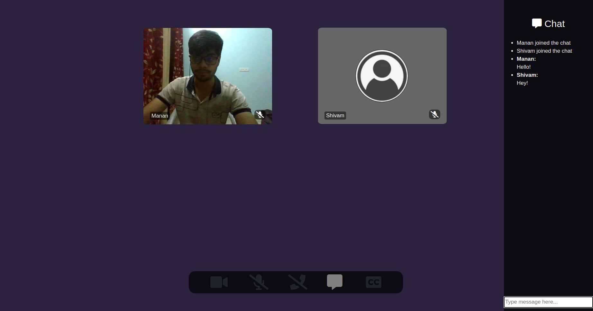
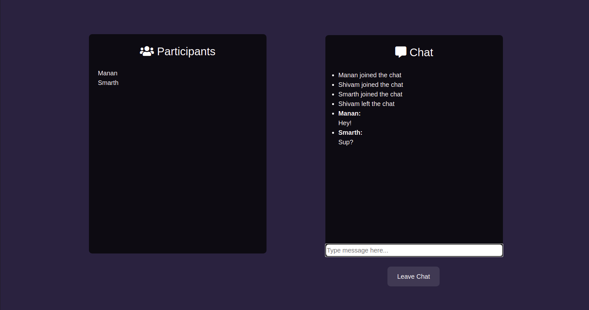
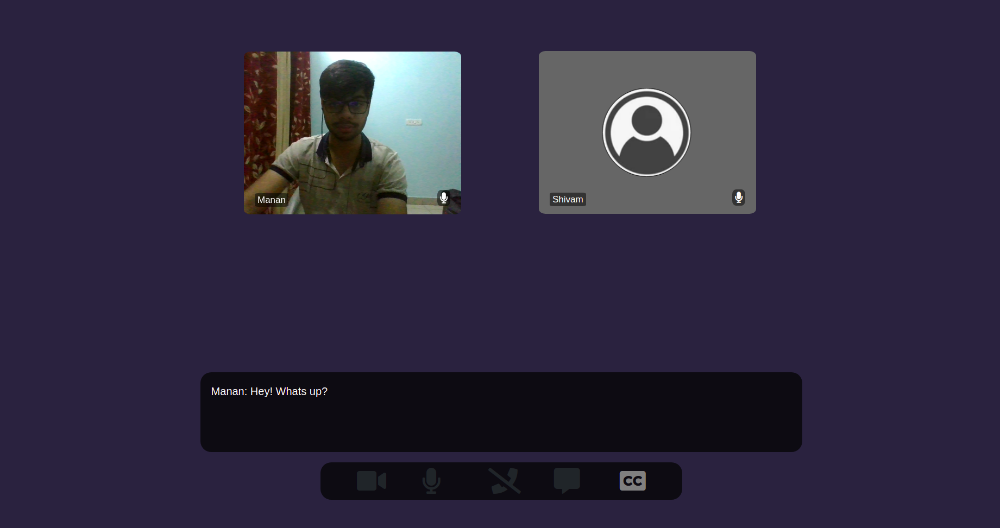

# **Teams Clone**
<link rel="stylesheet" type="text/css" media="all" />

## **Table of Contents**

- [About](#about)
- [Features](#features)
- [Installation Prerequisites](#installation-prerequisites)
- [How to use](#how-to-use)
- [Technology Stack](#technology-stack)

## **About**

This is a peer to peer video conferencing and chatting website where a group of users can create their rooms and join with video call or by chat, with an aditional feature of live video captioning ie speach to text.

## **Features**
**In call chat**  
<p align="center">
  
</p>

**Off call chat**  
<p align="center">
  
</p>

**Live speech to text**
<p align="center">
  
</p>

## **Installation Prerequisites**

- Nodejs

> To Download Nodejs Package [Go to the Nodejs Download Website](https://nodejs.org/en/download/).


## **How to run this Website**

**For Website**
1. Clone this Repo to your Local Machine using ```git clone https://github.com/manan-grover/Teams-Clone```.
2. Open The Terminal/CMD in the folder Face-Me.
3. Type ```npm i to install``` all the required packages.
4. Type ```npm start``` to run the nodejs server.
5. On a new Terminal/CMD, type ```peerjs --port 3001```
6. Open localhost:3030 in your browser and you will be redirected to a new room with sharable link.


## **Technology Stack**

- NodeJs
- Socket<span>.io
- Peerjs
- Web Speech API

## **Future Goals**

- Screen Sharing
- Sign in feature
- Shared white board


